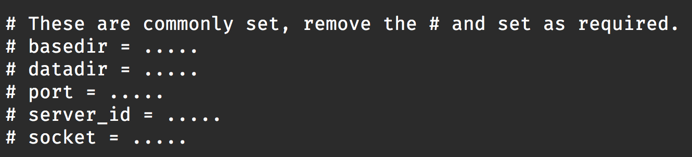

# mysql
mysql-5.7.17 install document

### 下载

```shell
链接: https://pan.baidu.com/s/1miSKXtu 密码: 6qcg
```

### 配置

```shell
cd /data/; tar -xvf mysql-5.7.17-linux-glibc2.5-x86_64.tar.gz
chown mysql:mysql mysql-5.7.17-linux-glibc2.5-x86_64 -R
cd mysql-5.7.17-linux-glibc2.5-x86_64
cp support-files/my-default.cnf ./my.cnf
```

修改配置文件my.cnf



```shell
basedir = /data/mysql-5.7.17-linux-glibc2.5-x86_64
datadir = /data/mysql-5.7.17-linux-glibc2.5-x86_64/data
port = 3306
server_id = 1
socket  = /data/mysql-5.7.17-linux-glibc2.5-x86_64/mysql.sock
```

tips: 可以根据 安装目录的需求自行修改.

### 安装

```shell
ln -sf /data/mysql-5.7.17-linux-glibc2.5-x86_64/bin/mysql /usr/bin/mysql
cd /data/
./bin/mysqld  --user=mysql --basedir=./ --datadir=./data --initialize-insecure
bin/mysqld_safe --defaults-file=./my.cnf --user=mysql & (若没有mysql 用户组，使用命令`groupadd mysql`)
ln -sf /data/mysql-5.7.17-linux-glibc2.5-x86_64/mysql.sock /tmp/mysql.sock
```

### 授权

- 登陆mysql

  ```shell
  mysql -uroot -s /tmp/mysql.sock	  # 验证是否可以登录，若不能登录，检查前面的步骤是否OK
  ```

- 给本地用户授权

  ```shell
  grant all on *.* to 'root'@'localhost' identified by 'Root@100.73';
  flush privileges
  ```

  到此,就可以用`mysql -uroot -p` 登陆mysql数据库了。
  若需要本地的这个用户给其他用户授权，可以通过添加`WITH GRANT OPTION` 选项来操作。 

  若需要通过远程登陆mysql机器，则需要对远程IP进行授权，具体可以参照mysql 官网grant syntax <https://dev.mysql.com/doc/refman/5.7/en/grant.html>

  ​